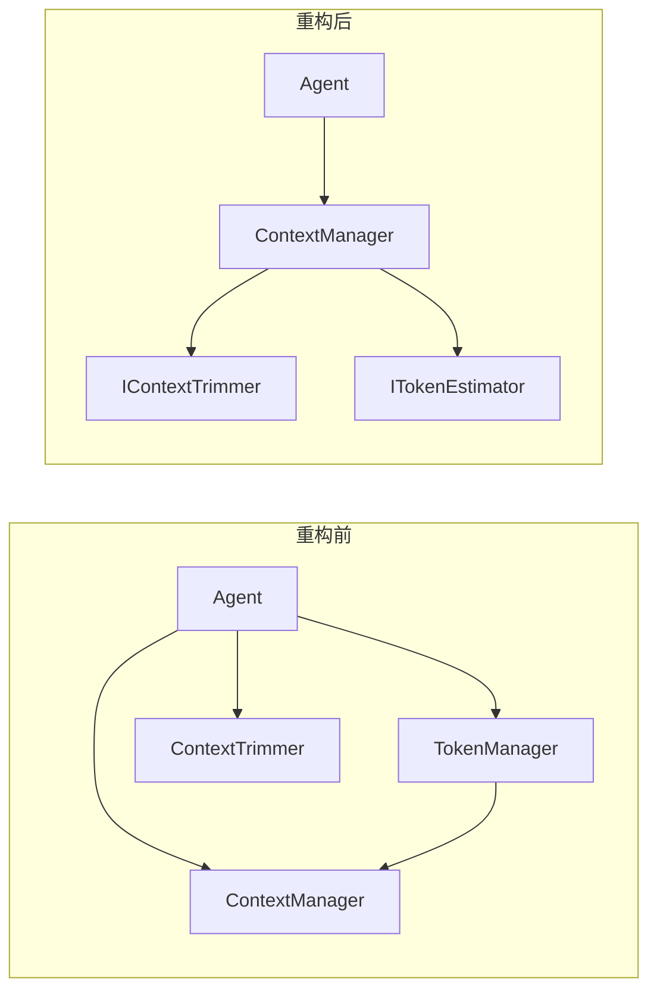

# ContextManager 自动剪枝重构

## 设计思路




## 核心改动

### 1. IContextManager 接口扩展

新增配置和 Token 统计方法：

```csharp
public interface IContextManager
{
    // 已有...
    
    // 新增：配置 Token 限制（调用方设置）
    void ConfigureTokenLimit(int maxTokens, int reservedTokens = 0);
    
    // 新增：记录 LLM 返回的 Token 使用情况
    void RecordTokenUsage(TokenUsage usage);
    
    // 新增：获取累计 Token 使用量
    TokenUsage TotalTokenUsage { get; }
}
```

### 2. GetChatMessages() 内部自动剪枝

关键改动：在 `GetChatMessages()` 内部判断是否需要剪枝，对外透明。

```csharp
public IReadOnlyList<ChatMessage> GetChatMessages()
{
    // 1. 检查是否需要剪枝
    TrimIfNeeded();
    
    // 2. 构建消息列表
    var messages = GetMessages();
    return _defaultBuilder.Build(messages);
}

private void TrimIfNeeded()
{
    if (_maxTokens <= 0 || _trimmer == null) return;
    
    var available = _maxTokens - _reservedTokens;
    if (EstimatedTokenCount <= available) return;
    
    _trimmer.Trim(this, (int)(available * _trimTargetRatio));
}
```

### 3. AddAssistantMessage 增强

LLM 返回后，由 ContextManager 统一处理：

```csharp
// 重载方法，接收 TokenUsage
void AddAssistantMessage(ChatMessage response, TokenUsage tokenUsage, string? agentId = null);
```

### 4. DefaultContextManager 新增字段

```csharp
public class DefaultContextManager : IContextManager
{
    // 已有...
    
    // 新增：剪枝相关
    private IContextTrimmer? _trimmer;
    private int _maxTokens;
    private int _reservedTokens;  // 预留给工具定义等
    private double _trimTargetRatio = 0.8;
    
    // 新增：Token 统计
    private TokenUsage _totalTokenUsage = new();
}
```

### 5. ToolLoopAgent 简化

移除所有剪枝相关代码：

```csharp
public class ToolLoopAgent : IAgent
{
    // 删除：_contextTrimmer, _tokenManager
    
    public async Task<AgentResult> ExecuteAsync(IContextManager context, ...)
    {
        // 配置 Token 限制（一次性）
        var tokenLimit = _modelProvider.Options.GetTokenLimits(...).EffectiveInputTokens;
        var toolTokens = EstimateToolDefinitionTokens(Options.Tools);
        context.ConfigureTokenLimit(tokenLimit, toolTokens);
        
        for (...)
        {
            // 获取消息（内部自动剪枝）
            var messages = context.GetChatMessages();
            
            // 调用 LLM
            var (response, tokenUsage) = await _llmCaller.CallAsync(...);
            
            // 添加响应并记录 Token（一步完成）
            context.AddAssistantMessage(response, tokenUsage, Id);
            
            // 处理工具调用或返回结果...
        }
        
        // 返回结果时从 context 获取累计 Token
        return AgentResult.Success(output, context, context.TotalTokenUsage, iteration);
    }
}
```

## 文件改动清单


| 文件                                                                                   | 改动                                                              |
| ------------------------------------------------------------------------------------ | --------------------------------------------------------------- |
| [IContextManager.cs](src/SreAgent.Framework/Contexts/IContextManager.cs)             | 新增 `ConfigureTokenLimit`, `RecordTokenUsage`, `TotalTokenUsage` |
| [DefaultContextManager.cs](src/SreAgent.Framework/Contexts/DefaultContextManager.cs) | 实现剪枝逻辑、Token 统计、修改 `GetChatMessages()`                          |
| [ToolLoopAgent.cs](src/SreAgent.Framework/Agents/ToolLoopAgent.cs)                   | 删除 `_contextTrimmer`, `_tokenManager`, 简化主循环                    |
| [AgentOptions.cs](src/SreAgent.Framework/Options/AgentOptions.cs)                    | 移除 `ContextTrimmer` 配置（移到 ContextManagerOptions）                |
| [ContextManagerOptions.cs](src/SreAgent.Framework/Contexts/IContextManager.cs)       | 新增 `Trimmer`, `TrimTargetRatio` 配置                              |
| [TokenManager.cs](src/SreAgent.Framework/Agents/TokenManager.cs)                     | 可删除或保留作为工具 Token 估算的辅助类                                         |


## 工厂方法更新

```csharp
// StartNew 支持配置剪枝器
public static DefaultContextManager StartNew(
    string userInput,
    string? systemPrompt,
    ITokenEstimator tokenEstimator,
    Guid? sessionId = null,
    IContextTrimmer? trimmer = null)  // 新增
```

## Agent 最终形态

```csharp
private async Task<AgentResult> RunMainLoop(IContextManager context, ...)
{
    // 一次性配置
    context.ConfigureTokenLimit(tokenLimit, toolTokens);
    
    for (var i = 0; i < Options.MaxIterations; i++)
    {
        // 获取消息（自动剪枝）
        var messages = context.GetChatMessages();
        
        // 调用 LLM
        var (response, tokenUsage) = await CallLlmAsync(messages, ct);
        
        // 记录响应（含 Token 统计）
        context.AddAssistantMessage(response, tokenUsage, Id);
        
        // 处理工具调用
        if (HasToolCalls(response))
        {
            await HandleToolCallsAsync(context, ...);
            continue;
        }
        
        // 返回结果
        if (TryGetOutput(response, out var output))
        {
            return AgentResult.Success(output, context, context.TotalTokenUsage, i + 1);
        }
    }
    
    return AgentResult.Failure(..., context, context.TotalTokenUsage);
}
```

Agent 代码从 ~200 行减少到 ~120 行，且不包含任何上下文管理逻辑。